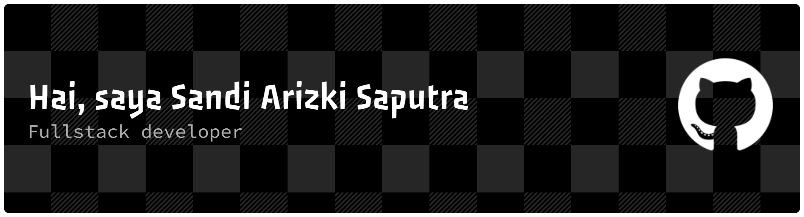

  

<h2 align="center">Sandi Arizki Saputra</h2>
<h4 align="center">Web Developer</h4>

  

---

### 👨‍💻 Tentang Saya
- 🌐 Portfolio: [portfolio-sandyy.netlify.app](https://portfolio-sandyy.netlify.app)  
- 📝 Blog: [sandy-softwareone.blogspot.com](https://sandy-softwareone.blogspot.com/)  
- 📫 Email: **sandiarizki68@gmail.com**  
- 📄 CV: [Lihat CV](https://github.com/sandi1377/CV/blob/main/CV-SANDI.pdf)

---

### 🤝 Terhubung dengan saya

  
  
  

---

### 🛠️ Bahasa dan Alat

---

### 📊 Statistik GitHub

  
   
  
   
  

